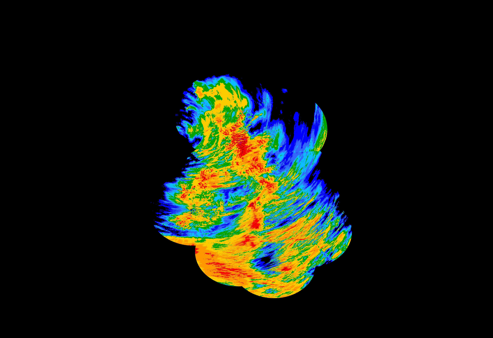
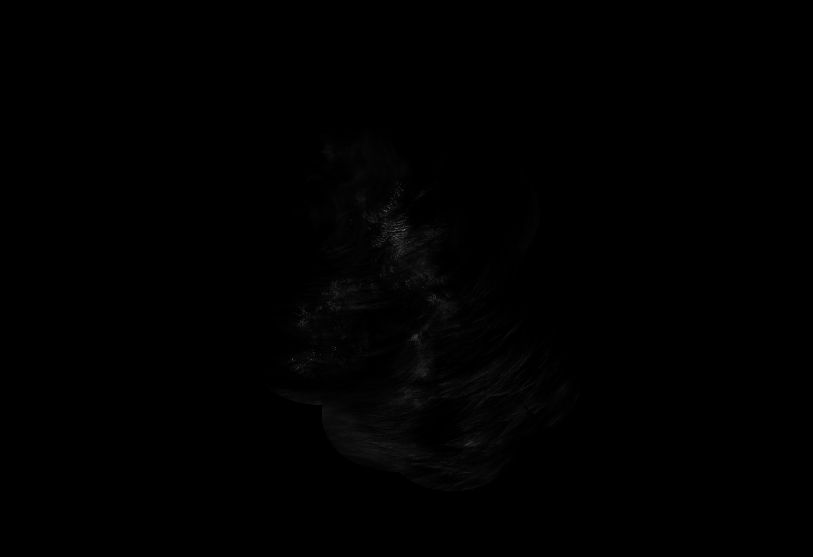
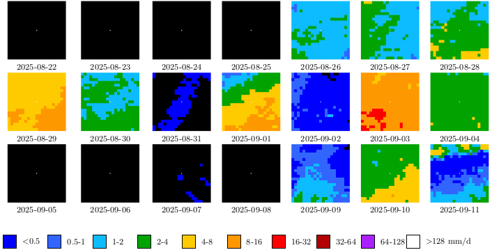
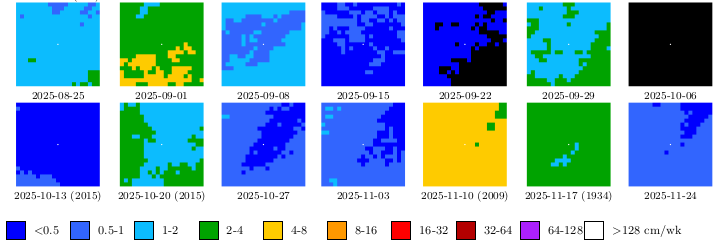

Downloads the metoffice rainfall radar images, summarises them daily, weekly, monthly, and yearly, and creates time laps videos for selected areas.\
If `pdflatex` is installed, it will also create pdf with the summarised images for the selected areas to provide a nice overview.
In the pdfs the centre of the images is marked with a small white dot.

### Installation/Requirements
```
git clone https://github.com/ronnyerrmann/rainfall
cd rainfall
python -m venv rain_venv
. rain_venv/bin/activate
pip install Image requests opencv-python psutil
```

Add crontab to run automatically every 8 hours:
```
1 */8 * * * /home/<user>/rainfall/rain_venv/bin/python /home/<user>/rainfall/rainfall_images.py
```

### Run
```
rain_venv/bin/python rainfall_images.py
```
All data will be stored in the folder of the script.

As data only a few days back is available, the script should be run at least every 24 hours. For courtesy, do not run it more than once per hour.

### Description
For the daily images the same scale as [metoffice uses in their rainfall radar](https://weather.metoffice.gov.uk/maps-and-charts/rainfall-radar-forecast-map#?model=ukmo-ukv&layer=rainfall-rate) is used, but instead of indicating mm/h it's mm/day.
Additionally purple for 64 to 128 and white for 128 to 999 mm/day were added.
If more than that value is reached, black will be shown, and you should build am arch.

As the publicly available data only provides ranges from `x` to `2x` mm/h (with `x` being the lower rainfall limit for a colour),
the resulting summaries for the day can be off by a similar amount.
The program uses the value at 33% of the range to reflect the assumed Poisson distribution of rainfall and that the rainfall measurement is done at discrete times.
The final values, given in the grey scaled image, have therefore a relative uncertainty of [+50% -25%].

The metoffice files are timestamped as UTC and this time is used to define a day,
which means for BST (British Summer Time) the daily images cover 1:00 to 1:00.

### Add your own areas
This can be done either by creating a file `subareas.csv` in the script folder, with comma-separated values for
1. (`int`) x-Pixel position in the original file in `image_data`, starting from 0. In the future, that should be derived from lat/lon but for now I used Irfanview to see the pixel position during a click (which is already 0 based). To know which pixel, I looked for rain reaching the position on the metoffice website.
2. (`int`) y-Pixel position in the original file in `image_data`.
3. longitude
4. latitude
5. semi-size of the box around the selected pixel, e.g. 1 leads to a 3x3 array, 10 to 21x21
6. scale of a pixel in the final image, e.g. a scale of 5 on a 3x3 array leads to a 15x15 png
7. name of the place

Alternatively, the script can be edited to add the lines containing `SUBAREAS.append` with the same entries (name needs to be in quotes)

### Example output
The full frames of the summed daily images are stored as `image_daily/YYYY-MM-DD_sum.png` (using the same colour coding as metoffice) 
and `image_daily/greyscale-mm_YYYY-MM-DD_sum.png` (using 8 bit grey-scale):





The full frames of the summed weekly, monthly, and yearly images are stored as `image_weekly_monthly_yearly/[wmy]YYYY-MM-DD_sum.png`
with `w`, `m`, `y` indicating weekly, monthly, and yearly, respectively.
The colour coding uses the same colours for the same numeric value ranges as metoffice,
but values indicate `cm/week`, `cm/month`, and `dm/year` with `1 cm = 10 mm` and `1 dm = 100 mm` (`1 m = 10 dm`).
The grey scale images are stored in `image_weekly_monthly_yearly/greyscale-<unit>_[wmy]YYYY-MM-DD_sum.png` (8 bit grey-scale),
using the same units as above: `cm`, `cm`, and `dm`.

The subframes are stored in `subframes_daily/Place_Name_YYYY-MM-DD.png` or `subframes_weekly_monthly_yearly/Place_Name_[wmy]YYYY-MM-DD.png`:


Finally, the subframes are added to a pdf document in `tex/Place_Name_rainfall.pdf`, starting with the yearly subframes,
followed by monthly, weekly, and daily data.
In it, bracketed numbers behind the date indicate the number of frames,
if not all the 288 daily or 2016 weekly rainfall images could be downloaded from metoffice.
For monthly and yearly summaries, the number of frames are always given.
A 3-week example of the daily and weekly summaries for my home is shown below as image (showing that it often rains less at home than the in surrounding area)
and [here is the whole pdf for of Place](Documentation/Bristol_rainfall.pdf).





